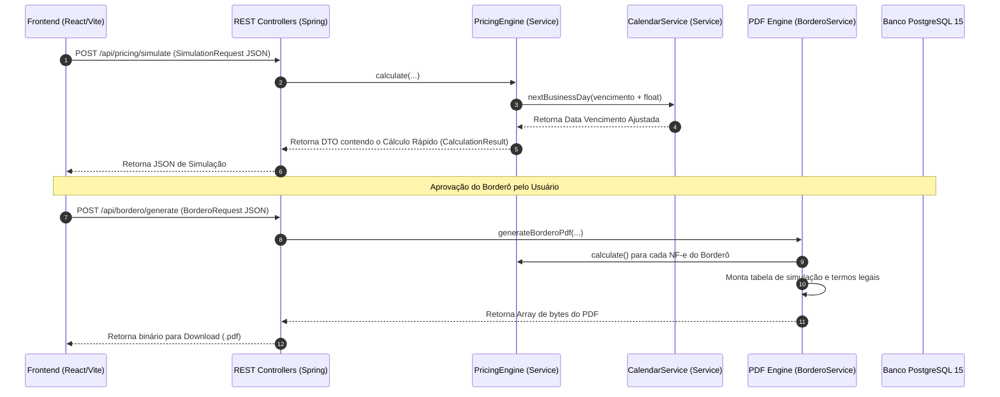

# IA369-GFactor: Documento de Análise Técnica e Modelagem

Este documento apresenta uma análise profunda do sistema **IA369-GFactor** (Factoring Management System), cobrindo sua arquitetura de alto nível, modelagem do banco de dados relacional, representação de DTOs/payloads das APIs, regras de negócio do mecanismo de cálculo (`PricingEngine`) e os procedimentos para execução local.

---

## 1. Visão Geral e Arquitetura de Alto Nível

O **IA369-GFactor** é um sistema projetado para gerenciar operações de factoring (aquisição de direitos creditórios). Sua principal finalidade é automatizar o cálculo e a simulação de deságio (juros), tarifas administrativas (Advalorem), impostos federais (IOF Fixo e Diário) e tarifas adicionais sobre pacotes de notas fiscais eletrônicas (NF-e), comumente organizados em **Borderôs**.

A arquitetura do sistema segue a divisão em três camadas básicas:

1. **Frontend (React / Vite)**: Interface rica construída com Tailwind CSS utilizando uma estética minimalista/brutalista. É responsável por interações de simulação, uploads e parametrização.
2. **Backend (Java / Spring Boot)**: Provedor de REST APIs, encapsulamento do core engine de precificação e geração do Borderô estruturado em PDF utilizando a biblioteca *OpenPDF*.
3. **Database (PostgreSQL 15)**: Persistência relacional protegida por versionamento de schema via migrações do *Flyway*.

### Fluxo de Comunicação Arquitetural



---

## 2. Estrutura de Diretórios do Projeto

O repositório está subdividido em componentes lógicos claros de frontend, backend e configurações de infraestrutura:

```plaintext
IA369-GFactor/
├── .agent/                  # Configurações do AG Kit (Agents & Skills)
├── backend/                 # Projeto Java Spring Boot (Maven)
│   ├── pom.xml              # Dependências e build do backend
│   ├── src/
│   │   ├── main/
│   │   │   ├── java/com/ia369/factoring/
│   │   │   │   ├── controller/   # Endpoints REST (Simulate, Bordero, Settings)
│   │   │   │   ├── model/        # Entidades JPA (Bordero, Titulo, Cedente, etc.)
│   │   │   │   ├── repository/   # Interfaces Spring Data JPA
│   │   │   │   └── service/      # Regras de Negócio (PricingEngine, CalendarService)
│   │   │   └── resources/
│   │   │       ├── application.yml         # Configuração JDBC, JPA e Hibernate
│   │   │       └── db/migration/           # Migrações Flyway SQL (V1 a V5)
│   └── target/              # Artefatos compilados (.jar)
├── frontend/                # SPA React construída com Vite e Tailwind CSS
│   ├── package.json         # Dependências npm scripts de execução (vite)
│   ├── postcss.config.js    # Utilitários PostCSS
│   ├── tailwind.config.js   # Paleta e fontes do tema brutalista do sistema
│   ├── vite.config.js       # Configuração de build do Vite
│   └── src/
│       ├── App.jsx          # Componente raiz e roteamento interno por abas
│       ├── main.jsx         # Ponto de entrada do React DOM
│       └── components/      # Formulário de simulação, uploader XML, telas
├── docs/                    # Diagramas, documentação conceitual e PDFs de apoio
├── .env                     # Variáveis de ambiente secretas locais (ignoradas no git)
├── docker-compose.yml       # Orquestrador PostgreSQL em container Docker
└── start-db-wsl.bat         # Script para acionamento facilitado de DB via WSL2
```

---

## 3. Modelagem de Banco de Dados (PostgreSQL)

Com base nas migrações Flyway (`V1__Initial_Schema.sql`, `V4__Sprint1_Postgres_Redesign.sql` e `V5__Add_Cedente_Fields.sql`), o esquema físico do PostgreSQL do sistema contém as seguintes tabelas, restrições e índices estruturais.

### 3.1. Tabela: `empresas_cedentes`
Representa os clientes vendedores dos direitos creditórios.
* **Modelo Físico:**
  ```sql
  CREATE TABLE empresas_cedentes (
      id BIGSERIAL PRIMARY KEY,
      razao_social VARCHAR(255) NOT NULL,
      cnpj VARCHAR(14) UNIQUE NOT NULL,
      taxa_padrao_desagio NUMERIC(18,6) NOT NULL,
      faturamento_anual DECIMAL(18,2),
      endereco_completo VARCHAR(500),
      contato_nome VARCHAR(200),
      contato_telefone_fixo VARCHAR(20),
      contato_celular VARCHAR(20),
      contato_email VARCHAR(200),
      versao INT DEFAULT 0,
      ativo BOOLEAN DEFAULT TRUE NOT NULL
  );
  ```

### 3.2. Tabela: `sacados`
Representa a empresa devedora do título (emissor da NF-e comprada).
* **Modelo Físico:**
  ```sql
  CREATE TABLE sacados (
      id BIGSERIAL PRIMARY KEY,
      razao_social VARCHAR(255) NOT NULL,
      cnpj_cpf VARCHAR(14) UNIQUE NOT NULL,
      limite_credito NUMERIC(18,4) NOT NULL,
      versao INT DEFAULT 0,
      ativo BOOLEAN DEFAULT TRUE NOT NULL
  );
  ```

### 3.3. Tabela: `borderos`
Lote agrupador de títulos criados para uma operação de aquisição consolidada.
* **Modelo Físico:**
  ```sql
  CREATE TABLE borderos (
      id BIGSERIAL PRIMARY KEY,
      numero_bordero VARCHAR(50) UNIQUE NOT NULL,
      cedente_id BIGINT NOT NULL,
      status VARCHAR(20) NOT NULL DEFAULT 'GERADO', -- Enum Java mapeado para TEXT/VARCHAR
      valor_face_total NUMERIC(18,4) NOT NULL,
      desagio_total NUMERIC(18,4) NOT NULL,
      iof_total NUMERIC(18,4) NOT NULL,
      tarifas_total NUMERIC(18,4) NOT NULL,
      valor_liquido_total NUMERIC(18,4) NOT NULL,
      parent_bordero_id BIGINT REFERENCES borderos(id), -- Auto-relacionamento para histórico de substituição
      data_criacao TIMESTAMP WITH TIME ZONE DEFAULT CURRENT_TIMESTAMP NOT NULL,
      versao INT DEFAULT 0,
      CONSTRAINT fk_bordero_cedente FOREIGN KEY (cedente_id) REFERENCES empresas_cedentes(id)
  );
  CREATE INDEX idx_bordero_status ON borderos(status);
  ```

### 3.4. Tabela: `titulos`
Armazena os dados unitários de cada NF-e negociada.
* **Modelo Físico:**
  ```sql
  CREATE TABLE titulos (
      id BIGSERIAL PRIMARY KEY,
      chave_nfe VARCHAR(44) UNIQUE,
      numero_documento VARCHAR(50) NOT NULL,
      cedente_id BIGINT NOT NULL,
      sacado_id BIGINT NOT NULL,
      bordero_id BIGINT REFERENCES borderos(id),
      valor_face NUMERIC(18,4) NOT NULL,
      valor_liquido_alocado NUMERIC(18,4),
      data_emissao DATE NOT NULL,
      data_vencimento DATE NOT NULL,
      data_vencimento_ajustada DATE NOT NULL,
      estado VARCHAR(20) NOT NULL DEFAULT 'DISPONIVEL', -- Enum mapeado para texto
      versao INT DEFAULT 0,
      CONSTRAINT fk_titulo_cedente FOREIGN KEY (cedente_id) REFERENCES empresas_cedentes(id),
      CONSTRAINT fk_titulo_sacado FOREIGN KEY (sacado_id) REFERENCES sacados(id)
  );
  CREATE INDEX idx_titulo_chave_nfe ON titulos(chave_nfe);
  CREATE INDEX idx_titulo_bordero ON titulos(bordero_id);
  ```

### 3.5. Tabela: `parametros_taxas`
Configurações financeiras aplicadas às contas dos Cedentes para os cálculos das operações.
* **Modelo Físico:**
  ```sql
  CREATE TABLE parametros_taxas (
      id SERIAL PRIMARY KEY,
      cedente_id VARCHAR(100),
      taxa_mensal DECIMAL(10, 4) NOT NULL,
      advalorem_percent DECIMAL(10, 4) NOT NULL,
      tarifa_boleto DECIMAL(10, 2) NOT NULL,
      iof_fixo DECIMAL(10, 4) NOT NULL DEFAULT 0.0038,
      iof_diario DECIMAL(10, 6) NOT NULL DEFAULT 0.0000411,
      is_padrao BOOLEAN DEFAULT FALSE,
      created_at TIMESTAMP DEFAULT CURRENT_TIMESTAMP
  );
  ```

### 3.6. Tabela: `tarifas_customizadas`
Tabela mapeada pelo Hibernate `@Entity` no backend para tarifas variáveis.
* **Modelo Físico Estimado:**
  ```sql
  CREATE TABLE tarifas_customizadas (
      id BIGSERIAL PRIMARY KEY,
      nome VARCHAR(255) NOT NULL,
      valor DECIMAL(10, 2) NOT NULL,
      tipo_cobranca VARCHAR(50) NOT NULL -- Mapeia enum: BORDERÔ, NOTA_FISCAL, TITULO
  );
  ```

### 3.7. Tabela: `auditoria_sistema`
Tabela imutável desenvolvida para histórico rígido de log de alterações de dados das entidades (Compliance).
* **Modelo Físico:**
  ```sql
  CREATE TABLE auditoria_sistema (
      id BIGSERIAL PRIMARY KEY,
      usuario_username VARCHAR(100) NOT NULL,
      acao VARCHAR(100) NOT NULL,
      modulo VARCHAR(50) NOT NULL,
      id_entidade VARCHAR(50) NOT NULL,
      estado_anterior JSONB,
      estado_posterior JSONB,
      ip_endereco VARCHAR(45) NOT NULL,
      data_hora TIMESTAMP WITH TIME ZONE DEFAULT CURRENT_TIMESTAMP NOT NULL
  );
  CREATE INDEX idx_auditoria_entidade ON auditoria_sistema(modulo, id_entidade);
  ```

---

## 4. Modelagem de DTOs e Payloads das APIs

No tráfego de rede entre a UI corporativa e o backend Spring Boot, os seguintes contratos JSON/DTOs base estruturam as operações de simulação financeira e emissão final de Borderô.

### 4.1. Payload de Simulação Financeira (`/api/pricing/simulate`)
* **Método / Destino**: `POST /api/pricing/simulate`
* **Descrição**: Simula os descontos e impostos aplicáveis a um título unitário.
* **Payload Enviado (JSON - Simula `SimulationRequest`):**
  ```json
  {
    "valorFace": 10000.00,
    "dataOperacao": "2026-07-20",
    "dataVencimento": "2026-08-20",
    "taxaMensal": 3.5000,
    "advaloremPercent": 0.5000,
    "tarifaBoleto": 5.00,
    "iofFixo": 0.0038,
    "iofDiario": 0.0000411,
    "floatBancario": 1,
    "tarifasCustomizadas": [
      {
        "id": 1,
        "nome": "Tarifa Abertura de Crédito",
        "valor": 12.00,
        "tipoCobranca": "BORDERÔ"
      }
    ]
  }
  ```
* **Payload Recebido (JSON - Representa `CalculationResult`):**
  ```json
  {
    "valorDesconto": 373.33,
    "valorAdvalorem": 50.00,
    "valorIofFixo": 38.00,
    "valorIofDiario": 13.15,
    "valorIofTotal": 51.15,
    "valorTarifasCustomizadas": 12.00,
    "valorLiquido": 9508.52,
    "custoTotalPercent": 4.91,
    "prazoEfetivo": 32,
    "vencimentoAjustado": "2026-08-21"
  }
  ```

### 4.2. Payload de Geração de Borderô (`/api/bordero/generate`)
* **Método / Destino**: `POST /api/bordero/generate`
* **Descrição**: Agrupa múltiplos títulos, calcula as regras dinâmicas e retorna um fluxo de bytes representando o Borderô em PDF oficial para download do usuário.
* **Payload Enviado (JSON - Mapeia `BorderoRequest`):**
  ```json
  {
    "cnpjCedente": "12345678000199",
    "taxaMensal": 3.50,
    "advaloremPercent": 0.50,
    "tarifaBoleto": 5.00,
    "iofFixo": 0.0038,
    "iofDiario": 0.0000411,
    "floatBancario": 1,
    "tarifasCustomizadas": [],
    "items": [
      {
        "numero": "NF-10023",
        "sacado": "Metalúrgica Silva Ltda",
        "valor": 15000.00,
        "vencimento": "2026-08-15",
        "dataEmissao": "2026-07-15"
      },
      {
        "numero": "NF-10024",
        "sacado": "Supermercados Alfa S.A.",
        "valor": 8500.00,
        "vencimento": "2026-09-02",
        "dataEmissao": "2026-07-15"
      }
    ]
  }
  ```
* **Payload Recebido**: Stream binário `application/pdf` gerando download direto.

---

## 5. Modo de Funcionamento (`PricingEngine`)

A engine de precificação financeira (`com.ia369.factoring.service.PricingEngine`) opera com rigores contábeis, garantindo precisão utilizando objetos `java.math.BigDecimal` em todas as fórmulas operacionais e aplicando arredondamento bancário (*Banker's Rounding* / `RoundingMode.HALF_EVEN`).

### 5.1. Regras Financeiras Matemáticas

O cálculo para cada título é processado nas seguintes etapas estruturadas:

1. **Ajuste de Float e Feriado**:
   * O sistema primeiro soma o "float bancário" (Dias úteis/corridos adicionais de compensação de carteira de cobrança, padrão `+1` dia) à data original de vencimento.
   * `vencimentoComFloat = dataVencimento + floatBancario`
   * Em seguida, se a data resultante cair em um feriado cadastrado (ou final de semana), ela é jogada para o próximo dia útil subsequente via `CalendarService.nextBusinessDay(...)`. Esta nova data de vencimento ajustada é gravada no banco como `data_vencimento_ajustada`.

2. **Cálculo do Prazo Total ($prazoTotal$)**:
   * O sistema calcula a diferença exata em dias corridos entre a data de realização da operação física de factoring (`dataOperacao`) e o vencimento final ajustado (`vencimentoAjustado`).
   * $t$ = Dias Corridos do período.

3. **Cálculo do Deságio / Desconto ($D$)**:
   * O deságio é calculado com base na taxa pro-rata diária, dividindo a taxa mensal por 30:
   * $fatorMensal = \frac{taxaMensal}{100}$
   * $fatorDiario = \frac{fatorMensal}{30}$
   * $D = V_{face} \times fatorDiario \times t$ (Arredondado em 2 casas decimais via `ROUND_HALF_EVEN`)

4. **Cálculo da Tarifa Advalorem ($Ad$)**:
   * Tarifa de administração de risco calculada sobre o valor de face total comprado:
   * $Ad = V_{face} \times \frac{advaloremPercent}{100}$ (Arredondado em 2 casas decimais)

5. **Cálculo do IOF (Imposto sobre Operações Financeiras)**:
   * O imposto federal brasileiro incide de maneira mista sobre a operação:
   * **IOF Fixo ($IOF_{fixo}$)**:
     $$IOF_{fixo} = V_{face} \times iofFixoRate$$
     *(Geralmente cobrado na alíquota padrão de $0,38\%$, ou seja, taxa de 0,0038)*
   * **IOF Diário ($IOF_{diario}$)**:
     $$IOF_{diario} = V_{face} \times iofDiarioRate \times t$$
     *(Geralmente cobrado na alíquota padrão diária de $0,00411\%$ por dia)*
   * **IOF Total ($IOF_{total}$)**:
     $$IOF_{total} = IOF_{fixo} + IOF_{diario}$$

6. **Tarifas Customizadas**:
   * O sistema acumula as tarifas adicionais cadastradas no banco de dados vinculadas àquela operação:
   * $Tarifas_{custom} = \sum (Tarifa_1 + Tarifa_2 + ...)$

7. **Valor Líquido ($V_{liq}$)**:
   * O valor líquido disponível para depósito na conta do cedente é o valor de face descontando todas as deduções mencionadas acima:
   * $V_{liq} = V_{face} - D - Ad - IOF_{total} - tarifaBoleto - Tarifas_{custom}$

8. **Custo Efetivo Total (CET em %)**:
   * Taxa percentual real cobrada do cliente cedente sobre o montante negociado:
   * $CET = \frac{V_{face} - V_{liq}}{V_{face}} \times 100$

---

## 6. Procedimento de Execução Local

Para executar o sistema em ambiente de desenvolvimento local, utilize os passos descritos abaixo.

### 6.1. Pré-requisitos
* Sistema Operacional: Windows (com suporte a WSL2 configurado).
* Instalações locais necessárias:
  * **WSL2** instalado com distribuição ativa do Ubuntu.
  * **Docker Desktop** rodando e conectado ao WSL2.
  * **Java JDK 17** ou superior (verifique com `java -version`).
  * **Maven** (verifique com `mvn -version`).
  * **Node.js v18+** e **npm** (verifique com `node -v` e `npm -v`).

### 6.2. Configuração e Inicialização do Banco

1. Garanta que o Docker esteja funcionando na sua máquina.
2. Certifique-se de que o arquivo `.env` esteja na raiz do projeto (`c:\Projetos\IA369-GFactor\.env`), definindo as variáveis:
   ```env
   DB_POSTGRES_USER=admDBFactor
   DB_POSTGRES_PASSWORD=I@369F@t0r
   ```
3. Execute o helper batch script localizado no diretório raiz para iniciar o serviço do PostgreSQL 15 dentro do Docker no WSL2:
   ```powershell
   # Na pasta raiz "c:\Projetos\IA369-GFactor"
   .\start-db-wsl.bat
   ```
   *(Este script viaja até a sua área de trabalho do WSL Bash, mapeia a porta 5432:5432 e ativa o container do banco de dados `ia369_db` persistindo os dados em volumes do Docker)*.

### 6.3. Inicialização do Backend

O backend realiza a reparação do banco e migra o histórico de migrações SQL do Flyway durante a inicialização automática do framework Spring Boot.

1. Abra um terminal shell (cmd ou powershell) e navegue até a pasta `backend/`:
   ```powershell
   cd c:\Projetos\IA369-GFactor\backend
   ```
2. Inicie o sistema via maven wrapper / plugin do Spring Boot:
   ```powershell
   mvn spring-boot:run
   ```
3. O console listará a criação automática de tabelas (Flyway) e exibirá a mensagem de que o servidor Spring Boot está escutando na porta **8080** (`http://localhost:8090`).

### 6.4. Inicialização do Frontend

O frontend se baseia em Vite para carregamento ultra-rápido de módulos JavaScript/React e requer a instalação das dependências descritas no `package.json`.

1. Abra outro terminal shell e navegue até o diretório `frontend/`:
   ```powershell
   cd c:\Projetos\IA369-GFactor\frontend
   ```
2. Instale as pastas de módulos npm necessárias (executado uma única vez):
   ```powershell
   npm install
   ```
3. Inicie o servidor Vite no modo de desenvolvimento:
   ```powershell
   npm run dev
   ```
4. O servidor iniciará na porta padrão **5173** (acesse via `http://localhost:5173`). O painel brutalista exibirá o simulador conectado ao backend localizado na porta `http://localhost:8090/api`.

---
*Análise elaborada para IA369 GFACTOR Command Center // Terminal ID: 1029.*
