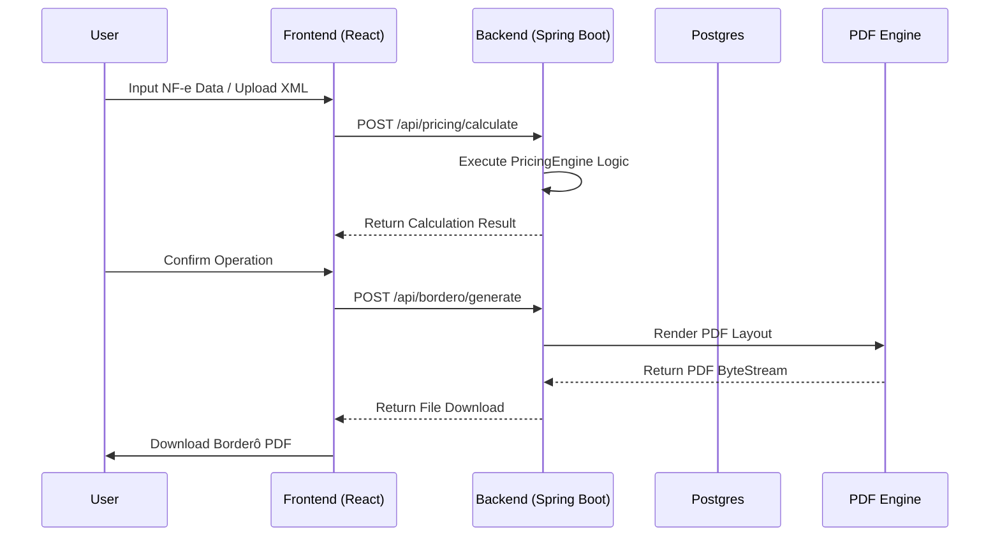

# IA369-GFactor - System Modeling & Architecture

## 1. Project Overview
The IA369-GFactor is a specialized Factoring Management System designed for high-precision financial operations. It handles the acquisition of credit rights (NF-e) by calculating discounts, fees, and taxes (IOF) based on maturity dates and operational parameters.

## 2. Core Domain Entities

### 2.1. Client (Cedente)
The entity that sells its credit rights to the factoring company. Each client has a set of agreed-upon rates (`ParametrosTaxas`).

### 2.2. Operation (Borderô)
A group of titles (NF-e) bundled for a single acquisition process. The system calculates the net value for the entire bundle.

### 2.3. Title (Título/NF-e)
Individual credit right being factored.
- **Attributes**: Number, Debtor (Sacado), Face Value (Valor de Face), Original Maturity (Vencimento).

## 3. Financial Calculation Engine (`PricingEngine`)

The system follows a strict mathematical model to ensure accounting compliance:

### 3.1. Mathematical Definitions
- **Discount (Deságio)**: $D = V_f \times \frac{i}{30} \times t$
  - $V_f$: Face Value
  - $i$: Monthly Rate (decimal)
  - $t$: Term in days (Adjusted Maturity - Operational Date)
- **Advalorem**: $A = V_f \times r_a$
  - $r_a$: Advalorem Rate (decimal)
- **IOF (Financial Operations Tax)**:
  - **Fixed IOF**: $IOF_f = V_f \times 0.0038$ (Standard 0.38%)
  - **Daily IOF**: $IOF_d = V_f \times 0.0000411 \times t$ (Standard 0.00411% per day)
- **Net Value**: $V_{liq} = V_f - (D + A + IOF_{total} + Tarifa + Tarifas_{custom})$

### 3.2. Lifecycle of a Calculation
1. **Float Addition**: The system adds banking float days (default: 1) to the original maturity.
2. **Holiday Adjustment**: If the resulting date falls on a weekend or holiday (verified via `CalendarService`), it rolls forward to the next business day.
3. **Term Calculation**: Calculates the exact number of calendar days between the date of operation and the adjusted maturity.
4. **Tax Application**: Applies interest rates, service fees (Advalorem), and government taxes (IOF).

## 4. System Architecture

### 4.1. Backend (Java / Spring Boot)
- **API Layers**: REST Controllers (`BorderoController`, `PricingController`).
- **Service Layer**: `PricingEngine` (isolated logic), `BorderoService` (PDF generation/workflow).
- **Persistence**: JPA/Hibernate with PostgreSQL (configured via Docker).
- **PDF Generation**: OpenPDF for generating formal acquisition documents.

### 4.2. Frontend (React / Vite)
- **UI Framework**: Tailwind CSS with a "Brutalist Financial Matrix" aesthetic.
- **Features**:
  - Real-time simulation of operations.
  - XML (NF-e) upload and parsing (planned/integrated).
  - Visualization of detailed tax breakdowns.

## 5. Integration Workflow

## 6. Technical Constraints
- **Precision**: Use of `java.math.BigDecimal` with `RoundingMode.HALF_EVEN` (Banker's Rounding) for all currency operations.
- **Rules**: Business day logic is centralized in `CalendarService` to accommodate Brazilian national holidays.
- **Infrastructure**: Containerized development environment using `docker-compose`.
